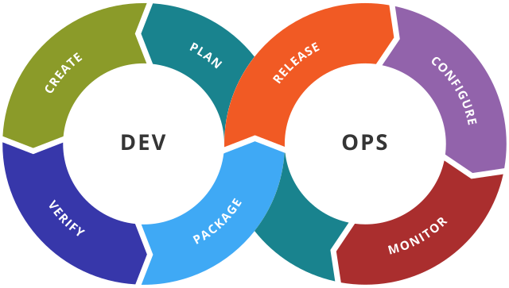
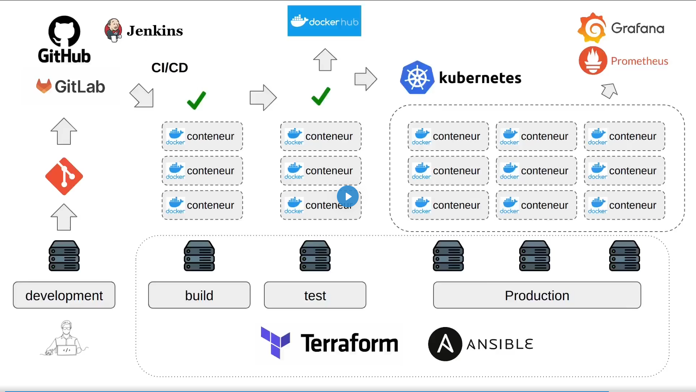

# 1. Introduction aux devops

## 1.1. Qu'est-ce que le DevOps ?

"DevOps" est la contraction des deux mots _development_ (développement) et _operations_ (exploitation).

Ce terme qui a été inventé par le belge **Patrick Debois** en 2007.

Le **DevOps** est un ensemble de pratiques qui visent à réduire le fossé entre le développement logiciel (**Dev**) et les opérations informatiques (**Ops**), d'où le terme.

L'idée est de favoriser une collaboration plus étroite et une meilleure communication entre ces deux entités qui, dans les modèles traditionnels, opèrent souvent de manière isolée.

Les principes clés du **DevOps** comprennent aujourd'hui :

- **L'intégration continue** (**CI** pour **continous integration** - le code est régulièrement fusionné et testé),
- **La livraison continue** (**CD** pour **continuous delivery** - les mise à jour du logiciel sont régulièrement libérées pour la production),
- **L'infrastructure en tant que code** (la gestion et la provision des infrastructures informatiques via le code - **IAC** pour **Infrastructure As Code**),
- **La surveillance et la journalisation** (le suivi en temps réel de la performance et des erreurs du logiciel),
- **La culture de la rétroaction** (l'encouragement à l'amélioration constante via les retours d'information).

Le schéma classique est celui-ci :

## 1.2. Les principaux outils du DevOps

### 1.2.1. Planification et collaboration

Ces outils permettent de créer des tâches et de gérer un projet. Les plus utilisés sont :

- **GitLab**
- **GitHub**
- **Jira**

### 1.2.2. Gestion du code (développement)

Ces outils permettent d'effectuer un contrôle de version du code. Les plus utilisés sont :

- **GitLab**
- **GitHub**
- **Bitbucket**

### 1.2.3. Intégration Continue / Déploiement Continu (CI/CD)

Ces outils surveillent les **commit** dans votre dépôt par exemple **GitHub**. Lorsqu'un commit est effectué, ils lance automatiquement un **pipeline** d'intégration continue qui peut compiler le code, exécuter des test unitaires, des tests d'intégration, et d'autres types de tests pour s'assurer que les dernières modifications n'ont pas introduit de bugs.

Si tous les test passent, ces outils peuvent être configurés pour déployer automatiquement les changements sur un environnement de production, de **stagin** ou de **test**. Cela accélère le processus de livraison de nouvelles fonctionnalités et de corrections de bugs.

Des solutions très connues sont :

- **Jenkins**
- **GitLab CI/CD**
- **GitHub actions**
- **AWS CodePipeline**
- **Azure DevOps**
- **CircleCI**
- **Travis CI**

### 1.2.4. Gestion de l'infrastructure

Ces outils permettent de faire des choses très variées mais concernent les serveurs et les **clusters**.

Nous pouvons citer quelques exemples :

- **Docker** : pour créer des images et ensuite les exécuter dans des conteneurs sur un **cluster**.
- **Docker Hub** : (ou tout autre **Container Registry** - il en existe plusieurs dizaines) : plateforme de service **cloud** qui perment aux développeurs de stocker et d'utiliser des images d'applications conteneurisées.
- **Kubernetes** (ou **k8s**) : plateforme qui automatise le déploiement, la mise à l'échelle (scalling) et la gestion des applications conteneurisées, offrant un cadre pour orchestrer et coordonner des contenaurs au sein d'un environnement de **cloud**.
- **Terraform** : outil d'**I**nfrastructure **a**s **C**ode (**IaC**) open source qui permet aux développeurs de définir et de fournir des infrastructures de centres de données en utilisant un langage de description déclaratif (on décrit l'état que l'on souhaite atteindre), facilitant ainsi la gestion et l'orchestration des ressources **cloud**.
- **Ansible** : outil d'automatisation open source qui permet la gestion de configuration, le déploeiement d'applications et l'orchestration de tâches sur une variété de systèmes et de plateformes (en résumépermet de configurer et de gérer des serveurs plus simplement).

### 1.2.5. Surveillance et retour d'information

Ces outils permettent de surveiller (**monitoring**) des **clusters** ou plus généralement des applications exécutées sur des serveurs.

Voici une listes des outils les plus courants :

- **Prometheus** : système de surveillance et d'alerte qui collecte est stocke les métriques d'application et de système en temps réel, offrant des fonctionnalités de requête et d'alerte pour aider à la détection et à la résolution des problèmes.
- **Grafana** : plateforme pour la visualisation et l'analyse de données, permetant aux utilisateurs de créer des tableaux de bord interactifs et compréhensibles pour surveiller et analyser en temps réel les données provenant de diverses sources, le plus souvent de **Prometheus**.
- **ELK Stack (Elasticsearch, Logstash, Kibana)** : suite d'outils qui fournit des capacité de recherche, d'analyse, de journalisation et de visualisation de doonnées, permettant aux utilisateurs de transformer leurs données en insights précieux.
- **Datadog / Nagios / New Relic / Sentry** : plateformes de surveillance et d'analyse des performances en temps réel pour les infrastructures **cloud**, les applications, les journaux et les métriques, facilitant la détectiio des problèmes et leur résolution.

### 1.2.6. Example d'infrastructure

L'example suivant montre une interaction des différents composants présenté ci-dessus dans une infrastructure de développement jusqu'à la production

