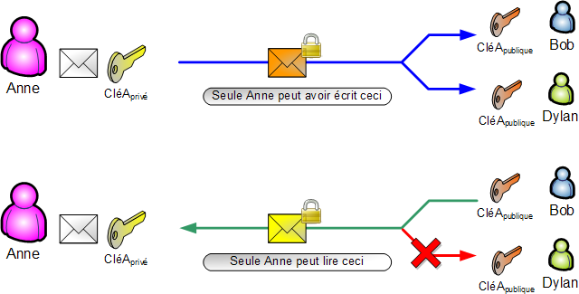

# 5. Rappels sur SSH

## 5.1. Les objectifs de la cryptographie

La cryptographie est un domaine s'attachant à protéger des messages.

Elle a trois objectifs principaux : la confidentialité, l'authenticité et l'intégrité des messages.

La **confidentialité** s'obtient par le chiffrement des messages, permettant de rendre un texte clair totalement incompréhensible pour celui qui ne peut déchiffrer le message à l'aide d'une clé (qui peut être une clé privée ou un secret comme nous le verrons).

L'**authenticité** permet de s'assurer qu'un message a bien été envoyé par un émetteur particulier.

L'**intégrité** permet de s'assurer qu'un message n'a pas été modifié par un tiers. Il repose sur l'utilisation d'une signature.

Les algorithmes et mécanismes en cryptogrfaphie permettent souvent de s'assurer d'un ou deux objectifs précités. Il faut donc souvent une combinaison de procéés et / ou d'algorithmes lorsque nous voulons nous assurer des trois objectifs.

Par exemple, l'utilisation de code d'authentification de message (**MAC** en anglais), permet de s'assurer de l'intégrité et de l'authentification d'un message mais ne permet pas de rendre un message confidentiel.

### 5.1.1. Les cryptographies symétrique et asymétrique

La cryptographie asymétrique, également apppelée cryptographie à clé publique, est une méthode de cryptographie utilisant deux clés : une clé publique et une clé privée.

La cryptographie symétrique est une cryptographie utilisant une donnée secrète, souvent appelée secret, partagée entre celui qui envoie et celui qui reçoit un message.

### 5.1.2. La cryptographie asymétrique

La cryptographie asymétrique permet de réaliser les trois objectifs de la cryptographie à savoir le chiffrement (confidentialité) et la signature (intégrité et authenticité) des messages.

Cela ne veut pas dire que tous les algorithmes de chiffrement asymétrique peuvent réaliser les trois objectifs.

Comme dit précédemment, le chiffrement asymétrique utilise des paires de clés : une publique et l’autre privée.

La clé publique est comme son nom l’indique totalement publique, elle peut être propagée à tous. Elle peut soit chiffrer un message, soit vérifier la signature d’un message.

La clé privée doit être totalement privée et maintenue secrète. Elle peut soit déchiffrer un message, soit créer une signature d’un message.

Prenons le schéma suivant :



Anne possède une clé privée et une clé publique et souhaite envoyer des messages à Bob et Dylan.

Dans le premier cas, Anne, Bob et Dylan veulent s’assurer de l’authenticité et de l’intégrité du message.

Autrement dit, ils veulent s’assurer qu’un message envoyé par Anne ne peut pas être modifié par un tiers, ou envoyé par un tiers se faisant passer pour Anne, sans que Bob et Dylan le sachent.

Pour ce faire, Anne a envoyé sa clé publique à Bob et Dylan avant d’envoyer ses messages. Sa clé publique peut être interceptée par un tiers lors de l’envoi, elle est publique donc cela n’importe pas.

Ensuite Anne va signer ses messages avec sa clé privée. Bob et Dylan pourront s’assurer grâce à la clé publique d’Anne que les messages n’ont pas été modifiés et qu’ils proviennent bien d’Anne.

En effet, seul le détenteur de la clé privée peut signer un message. Un détenteur de la clé publique ne peut que vérifier la signature. Si un seul caractère du message est modifié par un tiers, la signature ne correspondra plus au message et Bob et Dylan le sauront. Si un tiers essaye d’envoyer un message avec une fausse signature, Bob et Dylan le sauront également en vérifiant que la signature correspond au message à l’aide de la clé publique.

Dans le second cas, Anne, Bob et Dylan souhaitent s’assurer que les messages envoyés par Bob et Dylan à Anne ne puissent être lus que par Anne.

Pour ce faire, Anne a également envoyé sa clé publique à Bob et à Dylan.

Bob ou Dylan peuvent envoyer des messages qu’ils chiffrent avec la clé publique d’Anne.

Mais seule la clé privée d’Anne pourra déchiffrer les messages.

Un tiers interceptant les messages ne pourra pas les déchiffrer. Même Dylan ne pourra pas lire le message chiffré par Bob avec la clé publique d’Anne car il n’a pas la clé privée d’Anne.

### 5.1.3. Articulation entre cryptographie asymétrique et cryptographie symétrique

Souvent, il est souhaitable d’utiliser la cryptographie asymétrique pour partager un secret entre deux entités de manière sécurisé, puis d’utiliser ce secret pour utiliser la cryptographie symétrique.

Pourquoi utiliser la cryptographie symétrique ? Car elle est beaucoup plus rapide que la cryptographie asymétrique, et il est donc plus performant d’envoyer les messages de cette manière après qu’un secret ait été partagé.

Pourquoi ne pas utiliser uniquement la cryptographie symétrique ? Car il est nécessaire d’envoyer le secret de manière sécurisée.

Nous allons détailler le fonctionnement à haut niveau d’un échange de clés en cryptographie asymétrique puis d’un basculement vers la cryptographie symétrique.

Alice et Bob souhaitent s’envoyer une grande quantité de messages, dans les deux sens, et de manière parfaitement sécurisée.

- **Etape 1** - Alice et Bob génèrent chacun de leur côté leur propre paire de clés publique et privée.
- **Etape 2** - Alice et Bob s’échangent leur clé publique. Bob a maintenant la clé publique d’Alice et Alice celle de Bob.
- **Etape 3** - Bob crée une signature d’un message qui contient un secret avec sa clé privée.
- **Etape 4** - Bob utilise ensuite la clé publique d’Alice pour chiffrer le message et la signature. Il envoie le message et la signature totalement chiffrés à Alice.
- **Etape 5** - Alice reçoit le message chiffré et le déchiffre avec sa clé privée.
- **Etape 6** - Alice vérifie l’intégrité et l’authenticité du message, grâce à la signature qui a été déchiffrée, en utilisant la clé publique de Bob.

Alice est certaine de la confidentialité, de l’intégrité et de l’authenticité du message qu’elle a reçu. Elle peut donc utiliser le secret qu’elle a reçu dans le message en toute tranquillité.

- **Etape 7** - Alice chiffre un nouveau message en utilisant le secret, nous avons basculé en cryptographie symétrique.
- **Etape 8** - Bob déchiffre le message en utilisant le secret, maintenant partagé, et renvoie un nouveau message en le chiffrant avec le secret.

Les échanges sont maintenant totalement sécurisés et sont rapides car ils utilisent seulement un chiffrement symétrique.

## 5.2. Fonctionnement d'une connexion SSH

### 5.2.1. Étape d'établissement de la connexion

1. **Négociation des algorithmes** : lors de la première connexion, le client et le serveur s'accordent sur un ensemble d'algorithmes de chiffrement, d'authentification et d'intégrité à utiliser.
2. **Échange de clés** **Diffie-Hellman** : le client et le serveur utilisent l'algorithme **Diffie-Hellman** pour établir une clé secrète partagée, sans la transmettre sur le réseau. Cette clé servira à chiffrer la session.
3. **Vérification du serveur** : le client vérifie la clé publique du serveur en utilisant son empreinte, stockée localement dans le fichier `~/.ssh/known_hosts`. Cette étape permet de détecter les attaques "**man-in-the-middle**".

### 5.2.2. Authentification du client

1. **Mot de passe** : le moyen le plus simple, mais le moins sûr. Le mot de passe est transmis de manière sécurisée grâce à la clé partagée établie précédemment.
2. **Clé publique/privée** : une méthode plus sûre. Le client prouve sa possession d'une clé privée correspondante à une clé publique déjà stockée sur le serveur. Le client chiffre un défi avec sa clé privée, et le serveur tente de le déchiffrer avec la clé publique correspondante.

### 5.2.3. Session sécurisée

Une fois l'authentification réussie, le client et le serveur peuvent échanger des données de manière sécurisée. Le chiffrement et le déchiffrement sont effectués à la volée, en utilisant la clé partagée établie durant l'échange **Diffie-Hellman** et les algorithmes convenus lors de la négociation initiale.

### 5.2.4. Intégrité des données

**SSH** utilise aussi des codes d'authentification de message (**MAC, Message Authentication Codes**) pour garantir l'intégrité des données échangées.

### 5.2.5. Fermeture de la connexion

Quand la session est terminée, le client ou le serveur peut envoyer un message pour fermer la connexion. A ce stade, les clés de session peuvent être détruites.

En somme, **SSH** utilise une combinaison de cryptographie asymétrique pour l'établissement de la connexion et l'authentification, et de cryptographie symétrique pour le chiffrement des données, ce qui permet une sécurité robuste tout en minimisant la charge de calcul.

## 5.3. Qu'est-ce que SSH ?

**SSH**, qui signifie **Secure Shell**, est un protocole réseau qui permet une communication sécurisée entre deux systèmes en utilisant une architecture client-serveur.

En comprenant les bases de **SSH**, vous pourrez mieux appréhender comment **Ansible** établit des connexions sécurisées avec les **nodes** qu'il gère.

Dans cette leçon, nous allons couvrir quelques notions fondamentales de **SSH** essentielles pour travailler avec **Ansible**.

**SSH** est utilisé pour accéder à des machines à distance, pour exécuter des commandes sur ces machines, et pour déplacer des fichiers d'une machine à une autre.

Il remplace d'autres moyens d'accès à distance comme **telnet** et **rlogin**, qui ne sont pas sécurisés.

## 5.4. Les composants de base de SSH

- **Client SSH** : le logiciel qui initie la connexion. En général, c'est **OpenSSH** qui est disponible par défaut sur quasiment toutes les distributions **Linux** et sur **MacOS**. _Sur Windows (hors WSL) c'est le client intégré de PowerShell qui est utilisé. Une alternative courante est PuTTY. Mais dans ce cours vous devez utiliser WSL et donc OpenSSH._
- **Serveur SSH** : la machine distante à laquelle vous voulez vous connecter. le serveur **SSH** exécute un **daemon** (service en arrière-plan) qui écoute les connexions entrantes (le port par défaut est le **22**). Le plus souvent le serveur **SSH** est **sshd**.
- **Clés SSH** : elles sont utilisées pour établir et vérifier une connexion sécurisée entre le client et le serveur.

## 5.5. La suite OpenSSH

**OpenSSH** (**Open Secure Shell**) est une suite d'outils de connectivité réseau qui fournissent des communications sécurisées sur un canal non sécurisé. Voici les éléments principaux qui composent **OpenSSH** :

### 5.5.1. ssh

C'est le client de la connexion **SSH**. Il est utilisé pour initier des connexions à des serveurs **SSH**.

Exemple de base :

```SHELL
ssh utilisateur@adresse_serveur
```

Son fichier de configuration est situé la plupart du temps dans `~/.ssh/config`.

Il permet de définir des alias pour les connexions, de spécifier des clés à utiliser, et bien d'autres options.

Par exemple :

```CONFIG
Host my_memo_server_name
  HostName remote_server_address
  User remote_user
  Port 22
  IdentityFile ~/.ssh/my_secret_key
```

### 5.5.2. sshd (SSH daemon)

C'est le serveur **SSH** qui écoute les connexions entrantes. Il s'exécute généralement en arrière-plan sur le système que vous souhaitez contrôler à distance.

Le fichier habituel de son fichier de configuration est `/etc/ssh/sshd_config`.

### 5.5.3. ssh-keygen

Utilitaire pour la création de clés publiques et privées.

Exemple pour créer une clé RSA :

```SHELL
ssh-keygen -t rsa
```

### 5.5.4. ssh-agent et ssh-add

**ssh-agent** est un programme en arrière-plan qui gère vos clés privées.
**ssh-add** ajoute une clé privée au **ssh-agent**.

Par exemple :

```SHELL
eval $(ssh-agent)
ssh-add ~/.ssh/my_secret_key
```

### 5.5.5. scp (Secure Copy)

Permet de copier des fichiers de manière sécurisée entre des machines locales et distantes.

```SHELL
scp local_file.txt remote_user@remote_server:/path/Where/copy/file/
```

### 5.5.6. sftp (SSH File Transfer Protocol)

C'est un protocole sécurisé pour transférer des fichiers. Il utilise la même authentification que **ssh**.

```SHELL
sftp remote_user@remote_server
```

## 5.6. Commandes de base pour SSH

### 5.6.1. Génération de clés SSH

Pour générer une paire de clés **SSH** on utilise aujourd'hui le plus souvent l'algorithme **Ed25519** :

```SHELL
ssh-keygen -t ed25519 -C "My Secret Key"
```

Voici les options principales de la commande :

- `-C comment` : vous permet d'ajouter un commentaire ou une étiquette à la clé. utile pour identifier à quoi sert la clé.

```SHELL
sssh-keygen -t ed25519 -C "My Ansible Secret Key"
```

- `f file` : spécifie le nom du fichier dans lequel stocker la clé. Par défaut, la clé est stockée dans `~/.ssh/id_ed25519`.

```SHELL
ssh-keygen -t ed25519 -f ~/.ssh/my_ed25519_key
```

- `N passphrase` : permet de définir une phrase de mot de passe pour sécuriser la clé privée. Si omise, la clé sera créée sans mot de passse.

```SHELL
ssh-keygen -t ed25519 -N "AV3ryS3cur3P@ssW0rd1#-2025"
```

### 5.6.2. Se connecter via SSH

Pour vous connecter à un serveur, vous pouvez utiliser la commande suivante :

```SHELL
ssh remote_user@remote_server
# or
ssh -l remote_user remote_server
```

### 5.6.3. Transfert de clés SSH

Avant d'utiliser **SSH** avec **Ansible**, vous devrez transférer votre clé publique **SSH** sur le serveur distant. Cela peut être fait notamment avec **ssh-copy-id** :

```SHELL
ssh-copy-id remote_user@remote_server
```

## 5.7. Le fichier `~/.ssh/know_hosts`

Le fichier `~/.ssh/known_hosts` est un fichier qui stocke les empreintes digitales des clés publiques des serveurs **SSH** auxquels vous vous êtes connecté.

Chaque fois que vous vous connectez à un serveur **SSH** pour la première fois, le système vous demande de confirmer l'authenticité du serveur.

Si vous acceptez, l'empreinte digitale de la clé publique du serveur est stockée dans ce fichier.

Ce fichier est utilisé pour la vérification de l'hôte lors des connexions **SSH** ultérieures. Le but est d'empêcher les attaques "**man-in-the-middle**", où un attaquant pourrait essayer de se faire passer pour le serveur cible.

Si l'empreinte digitale de la clé du serveur auquel vous essayez de vous connecter ne correspond pas à celle stockée dans votre fichier `known_hosts`,

**SSH** vous avertira et interrompra la connexion.

Structure du fichier :

- Chaque ligne représente un hôte ou un groupe d'hôtes.
- Les lignes sont composées de 3 parties séparées par des espaces : l'adresse de l'hôte, le type de clé (par exemple, **ecdsa-sha2-nistp256**) et la clé publique elle-même.

Pour supprimer une clé d'un hôte en particulier, vous pouvez simplement supprimer la ligne correspondante dans le fichier `known_hosts`. Vous pouvez également utiliser la commande **ssh-keygen** pour gérer ce fichier :

Pour supprimer une clé pour un hôte spécifique :

```SHELL
ssh-keygen -R [hostname]
```

Pour ajouter une clé pour un hôte spécifique :

```SHELL
ssh-keyscan [hostname] >> ~/.ssh/known_hosts
```

La commande **ssh-keyscan** est un utilitaire pour scanner les clés publiques des serveurs **SSH**.

Elle sert principalement à recueillir les empreintes digitales des clés publiques d'un ou de plusieurs hôtes **SSH** sans avoir à vous connecter manuellement à ces hôtes. C'est utile pour construire ou mettre à jour le fichier `~/.ssh/known_hosts`, ce qui peut aider à prévenir les attaques de type "**man-in-the-middle**".

Quand vous exécutez cette commande, **ssh-keyscan** tente d'établir une connexion **SSH** avec l'hôte indiqué, récupère sa clé publique, et l'affiche sur la sortie standard. Vous pouvez rediriger cette sortie vers votre fichier `known_hosts` pour ajouter la clé.

Gardez à l'esprit que **ssh-keyscan** ne valide pas l'authenticité des hôtes lors de la récupération des clés. Vous devez toujours vérifier manuellement les empreintes digitales des clés pour garantir qu'elles sont correctes.

## 5.8. Le fichier `authorized_keys`

Le fichier `~/.ssh/authorized_keys` est un fichier texte qui contient une liste de clés publiques **SSH**, une par ligne, qui sont autorisées à se connecter à un compte utilisateur donné sur un serveur **SSH**.

Quand un client tente de se connecter à un serveur en utilisant une authentification par clé **SSH**, le serveur vérifie si la clé publique du client est présente dans ce fichier pour l'utilisateur spécifié.

Voici comment cela fonctionne étape par étape :

1. tentative de connexion : un client tente de se connecter au serveur **SSH** en spécifiant une clé privée.
2. envoi de la clé publique : le client envoie la clé publique correspondante au serveur.
3. vérification de la clé publique : le serveur cherche la clé publique dans le fichier `~/.ssh/authorized_keys` de l'utilisateur auquel le client essaie de se connecter.
4. comparaison des clés : si la clé publique est trouvée dans le fichier `authorized_keys`, le serveur génère un défi cryptographique et l'envoie au client.
5. résolution du défi : le client utilise sa clé privée pour résoudre ce défi et renvoie la solution au serveur.
6. confirmation et accès : le serveur utilise la clé publique pour vérifier la solution. si elle est correcte, l'accès est accordé.

Le fichier peut contenir plusieurs types de clés (**RSA**, **DSA**, **ECDSA**, etc.). une entrée typique ressemblerait à ceci :

```SHELL
ssh-rsa AAAAB3Nz...snip...QcV4H== remote_user@somewhere.tld
```

- `ssh-rsa` : spécifie le type de clé (dans ce cas, **RSA**).
- `AAAAB3Nz...snip...QcV4H==` : est la clé publique encodée en **base64**.
- `remote_user@somewhere.tld` : est un commentaire pour identifier la clé.
